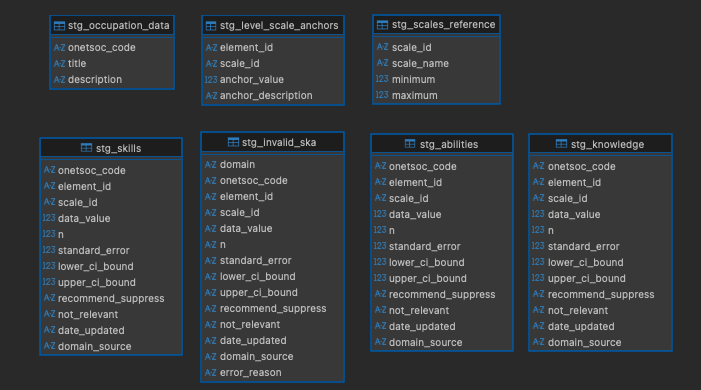

## Tulsa Workforce: O\*NET Occupation Data Warehouse (Prototype)

Lightweight, local-first SQLite warehouse built from O\*NET Occupation Data (plus Skills/Knowledge/Abilities). Pure-Python ETL (stdlib only), clear schema, and ready-to-run sample queries.

## Dataset

- Source: O\*NET Occupation Data (titles/descriptions) and SKA ratings (Skills/Knowledge/Abilities).
- Docs: https://www.onetcenter.org/database.html
- Files used (place under `data/raw/`):
  - `03_occupation_data.sql`
  - `16_skills.sql`, `15_knowledge.sql`, `11_abilities.sql`
  - `06_level_scale_anchors.sql`
- SOC Major Groups lookup (scraped from the website): `soc_major_groups.csv` with columns `code_full,name`.

## Schema Overview

SQLite schema lives in `warehouse/schema.sql` and loads into `warehouse/onet.db`.

See also: [Tables Overview](docs/tables_overview.md) for a narrative of why each table exists and how it’s used.

- `stg_occupation_data`, `stg_skills`, `stg_knowledge`, `stg_abilities`, `stg_level_scale_anchors`, `stg_scales_reference`:
  Staging tables to land raw rows before building dims/fact.
- `dim_occupation`:
  Surrogate `occupation_id` PK + unique `onetsoc_code`, title, description, `major_group_code` (FK to `dim_major_group`).
- `dim_major_group`:
  SOC major group lookup (PK `major_group_code`), with `code_full` and `name`.
- `dim_element`:
  SKA elements with `element_id` and `domain` ('SKILL'|'KNOWLEDGE'|'ABILITY').
- `dim_scale`:
  Scale reference (PK `scale_id`), currently seeded with IM and LV only.
- `dim_element_scale`:
  Anchor descriptions keyed by (`element_id`, `scale_id`, `anchor_value`) with FKs to `dim_element` and `dim_scale` (used for LV examples).
- `fact_occupation_element_rating`:
  Unified SKA fact with grain (`occupation_id`, `element_id`, `scale_id`), measures (`data_value`, `n`, `standard_error`, CI bounds), flags, `date_updated`, and `domain_source`. Join to `dim_element` for domain.

## Pipeline Flow

High-level flow from raw files to analytics:

- Bronze: `data/raw/*.sql` (O\*NET dumps), optional `soc_major_groups.csv`.
- Extract: parse SQL inserts in-memory (strip `GO`).
- Transform: normalize text/flags/dates; validate keys/scales; coerce numerics; drop invalids to `stg_invalid_ska`.
- Stage: load `stg_*` tables.
- Build dims: `dim_occupation`, `dim_major_group`, `dim_element`, `dim_scale`, `dim_element_scale`.
- Build fact: `fact_occupation_element_rating`.
- Query: run SQL in `queries/` and export CSVs.

Visual overview (staging tables):



### End-to-End ETL Flowchart


## Relational Schema

Core entities and relationships in `warehouse/schema.sql`:

- `dim_occupation`

  - PK: `occupation_id`
  - Natural key: `onetsoc_code` (unique)
  - Attributes: `title`, `description`, `major_group_code`
  - Use: hub for all occupation-level joins

- `dim_major_group` (optional lookup)

  - PK: `major_group_code` (2-digit)
  - Attributes: `code_full`, `name`
  - Join: `dim_occupation.major_group_code` → `dim_major_group.major_group_code`

- `dim_element`

  - PK: `element_id`
  - Attributes: `domain` ∈ {'SKILL','KNOWLEDGE','ABILITY'}
  - Use: defines what is being rated across SKA

- `dim_element_scale`

  - PK: (`element_id`, `scale_id`, `anchor_value`)
  - Attributes: `anchor_description`
  - Join: `element_id` → `dim_element.element_id`

- `fact_occupation_element_rating`
  - Grain: (`occupation_id`, `element_id`, `scale_id`)
  - Measures: `data_value`, `n`, `standard_error`, `lower_ci_bound`, `upper_ci_bound`
  - Flags/meta: `recommend_suppress`, `not_relevant`, `date_updated`, `domain_source`
  - FKs: `occupation_id` → `dim_occupation`; `element_id` → `dim_element`; `scale_id` → `dim_scale`
  - Indexes: on `occupation_id`, `element_id`, `scale_id` for fast filters/joins

Staging tables mirror raw fields (`stg_occupation_data`, `stg_skills`, `stg_knowledge`, `stg_abilities`, `stg_level_scale_anchors`, `stg_scales_reference`). Invalid SKA rows are persisted to `stg_invalid_ska` (with `domain` and `error_reason`).

ER sketch:


## ETL Logic and Validation

Entry: `etl/run_pipeline.py`

- Extract (`etl/extract.py`):
  - Reads SQL Server INSERT dumps (strips `GO`) in-memory and selects rows.
- Transform (`etl/transform.py`):
  - Occupations: trim/dedupe; derive `major_group_code`; default missing text to 'unavailable'.
  - SKA: enforce keys (`onetsoc_code` SOC mask, `element_id`, `scale_id` in IM/LV); trim; normalize flags (Y/N/unavailable) and dates (ISO/unavailable); coerce numerics; ensure CI order.
- Load (`etl/load.py`):
  - Creates schema; loads staging; upserts dims; builds the fact.
- Validation (staging-only; `etl/validate.py`):
  - Prints row counts for `stg_*`.
  - Checks that SKA key columns don’t contain 'unavailable'.
  - SOC code passes a simple mask `__-____.__`.
  - Invalid SKA rows are dropped during transform; counts logged.

### Data Quality Handling

- Invalid SKA rows are persisted to `stg_invalid_ska` with the original fields plus `domain` and `error_reason` (e.g., `invalid_soc_format`, `missing_element_id`, `invalid_scale_id`).
- Numerics are coerced; unparsable values become NULL (no imputation with 0 or -1).
- Text defaults in staging: missing `recommend_suppress`, `not_relevant`, `date_updated`, `domain_source` are set to `'unavailable'` (only for staging convenience; fact keeps types/NULLs intact).
- CI sanity: if `lower_ci_bound` > `upper_ci_bound`, they are swapped during transform.
- Where to inspect invalids: `SELECT domain, error_reason, COUNT(*) FROM stg_invalid_ska GROUP BY 1,2;`

## How To Run

Requirements: Python 3.9+ (stdlib only). SQLite comes bundled with Python as the `sqlite3` module.
If your environment lacks `sqlite3, install `pysqlite3-binary` from requirements.txt.

Optional (recommended) virtual environment:

```
python -m venv .venv
source .venv/bin/activate  # Windows: .venv\Scripts\activate
# Installs optional fallback only; core project has no external deps
pip install -r requirements.txt
```

1. Place raw files under `data/raw/` as listed above.
2. Build the warehouse:

```
python -m etl.run_pipeline --raw_dir data/raw --db_path warehouse/onet.db --schema warehouse/schema.sql
```

Output: `warehouse/onet.db` with dims and fact populated. Console logs show extract counts, staging loads, validations, and upserts.

## Queries and Results

Example queries live in `queries/` (highlights):

- `00_lv_value_with_anchor.sql`: LV values joined to nearest anchor description (rounded).
- `01_avg_im_by_major_group.sql`: Average IM per SOC major group.
- `02_top_elements_by_importance.sql`: Top elements by average IM across occupations.

Run and export all to CSV:

```
python queries/run_queries.py --db_path warehouse/onet.db --queries_dir queries --out_dir outputs/queries
```

CSV results are written to `outputs/queries/`.

## Future Enhancements

- SCDs for dimensions: add Type 2 history for dims.
- Date modeling: add `dim_date` and store a `date_key` in fact for easy month/quarter rollups (or derive year/month columns).
- Incremental loads: idempotent, partitioned ingest with simple watermarking (e.g., by `date_updated`).
- Performance: add covering indexes based on real query patterns (e.g., `(element_id, scale_id)` and `date_updated`).
- Tasks and additional domains: ingest O\*NET Tasks and other tables when needed.
- Anchors for IM: O\*NET IM anchors, store them in `dim_element_scale` alongside LV.
- CI/test harness: add a minimal test that runs ETL on a tiny fixture and verifies key counts/constraints.
